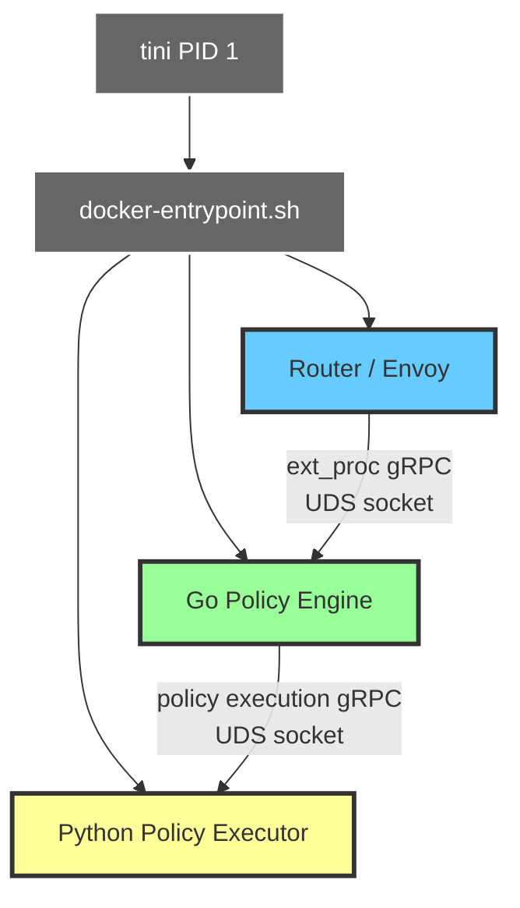
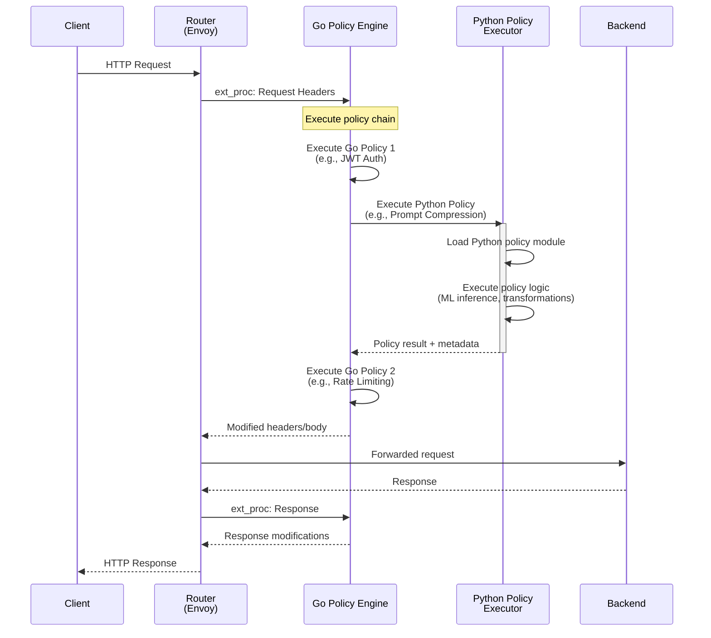

## Summary

* Add Python runtime support to the gateway, enabling policies to be written in Python alongside existing Go policies
* Run Python policy executor as a third managed process within the unified gateway-runtime container
* Use Unix Domain Socket (UDS) for Go Policy Engine ↔ Python Policy Executor communication (with TCP fallback option)
* Enable ML/AI-powered policies by leveraging Python's rich ecosystem of libraries (scikit-learn, transformers, numpy, etc.)
* Users can mix Go and Python policies in the same policy chain for a single API

## Motivation

The API Platform gateway currently supports policies written exclusively in Go. While Go provides excellent performance and is well suited for high-throughput request processing, some policy use cases involving machine learning and AI are more naturally expressed in Python because of its extensive ML and AI ecosystem.

**Key drivers:**

* **AI Gateway Use Cases**: As the platform evolves to support AI gateway capabilities, policies need access to ML/AI libraries for tasks. For example:
  - Prompt compression and optimization (reducing token costs for LLM calls)
  - Content moderation and safety filtering using ML models
  - Semantic routing based on embeddings
  - Response quality evaluation and scoring
* **Ecosystem Access**: Python's rich ecosystem (transformers, langchain, numpy, scikit-learn, etc.) enables sophisticated policy logic that would be impractical to reimplement in Go
* **Developer Flexibility**: Allow policy authors to choose the right tool for the job—Go for performance-critical policies, Python for ML/AI-driven logic
* **Faster Development and Iteration**: Leverage existing Python-based ML pipelines and models without requiring Go rewrites

**Example Use Case: Prompt Compression Policy**

An AI gateway handling LLM requests can benefit from a prompt compression policy that:
1. Analyzes incoming prompts using NLP libraries
2. Applies compression techniques to reduce token count
3. Maintains semantic meaning while lowering API costs
4. Implemented in Python using libraries such as `llmlingua` or `compression-prompt`, which have no Go equivalents

## Proposal

Extend the unified gateway-runtime container (which currently manages Router and Go Policy Engine as described in the [Unified Gateway Container proposal](https://github.com/wso2/api-platform/discussions/939)) to include a **Python Policy Executor** as a third managed process. The three processes will run under `tini` as PID 1, with the existing entrypoint script extended to manage Python policy lifecycle in addition to Router and Go Policy Engine.

**Architecture at a glance:**
```
┌─────────────────────────────────────────────────────────┐
│ gateway-runtime container                               │
│                                                         │
│  tini (PID 1)                                           │
│    └─ docker-entrypoint.sh                              │
│         ├─ Router (Envoy)          [rtr]                │
│         ├─ Go Policy Engine        [pol]                │
│         └─ Python Policy Executor  [py-pol]  ← NEW      │
│                                                         │
│  /app/policy-engine.sock      ← Router ↔ Go PE          │
│  /app/python-policy.sock      ← Go PE ↔ Python PE       │
└─────────────────────────────────────────────────────────┘
```

**Request flow:**
1. Client sends API request to Router (Envoy) on port 8080/8443
2. Router invokes Go Policy Engine via ext_proc filter (UDS)
3. Go Policy Engine executes policy chain:
   - Go policies execute directly within the Go runtime
   - When a Python policy is encountered, Go Policy Engine delegates to Python Policy Executor via gRPC (UDS)
   - Python Policy Executor loads and executes the Python policy logic
4. Policy results flow back: Python PE → Go PE → Router → Backend/Client

## Architecture Diagrams

### Process Tree



### Request Flow Sequence



## Changes Required

### Core Components

1. **gateway-runtime Container**
   - Add Python 3.10+ runtime to Dockerfile (with multi python version support if needed)
   - Extend entrypoint script to manage Python Policy Executor as third process
   - Create isolated venvs for each Python policy during build (dependency isolation)

2. **Python Policy Executor** (New Process)
   - gRPC server managing Python policy subprocesses via `ProcessPoolExecutor`
   - Communicates with Go Policy Engine over UDS (Unix Domain Socket)
   - Executes policies by calling venv-specific Python interpreters directly

3. **Go Policy Engine Extensions**
   - Detect Python policies in chain and delegate to Python PE via gRPC
   - Handle policy results and integrate into chain execution

4. **Gateway Builder**
   - Discover Python policies from manifest (similar to Go module discovery)
   - Create virtual environments per policy with isolated dependencies
   - Generate Python policy registry (discovery mechanism to be determined)


## Implementation Details

### Dependency Isolation via Virtual Environments

**One venv per policy**: Each Python policy gets its own virtual environment with isolated dependencies, preventing dependency conflicts between policies.

**Build process** (multi-stage Docker):
1. **Builder stages**: Default single builder stage for base Python version (e.g., `FROM python:3.10-slim AS builder`). If needed, add additional builder stages for other Python versions (e.g., `FROM python:3.11-slim AS python311-builder`)
2. **Per-policy venv creation**: For each policy, read `python_version.txt` and `requirements.txt`
   - Create venv: `python3.X -m venv /policies/<policy_name>/venv`
   - Install dependencies: `/policies/<policy_name>/venv/bin/pip install -r requirements.txt`
3. **Runtime stage**: Copy all policy directories with their pre-built venvs from builder stages using `COPY --from=<builder>` directives

Policy execution calls the venv's Python binary directly:
```bash
/policies/my-policy/venv/bin/python /policies/my-policy/policy.py
```

**Multi-version support (optional)**: If policies specify different Python versions (3.10, 3.11, etc.), the builder creates appropriate venvs from the corresponding builder stage.

### Process Model and Subprocess Management

**Python Policy Executor Architecture**:
- Python process with embedded gRPC server (communicates with Go Policy Engine via UDS)
- Uses `ProcessPoolExecutor` to manage Python subprocess execution
- Each policy execution spawns subprocess calling the policy's venv-specific Python interpreter
- **Managed by Python Policy Executor, not tini**: The individual Python policy subprocesses are spawned and managed by the Python Policy Executor's `ProcessPoolExecutor`, giving fine-grained control over policy execution lifecycle

**Execution flow**:
1. Go Policy Engine identifies Python policy in chain → sends gRPC request to Python Policy Executor
2. Python Policy Executor receives the request
3. Python Policy Executor spawns subprocess: `subprocess.run([venv_python, policy_py], input=json_input, capture_output=True)`
4. Policy executes in isolated subprocess with its venv dependencies
5. Python Policy Executor returns result to Go Policy Engine via gRPC response

**Benefits of subprocess model**:
- **Crash isolation**: Policy crash doesn't affect Python Policy Executor or other policies
- **Resource isolation**: Per-execution memory limits, no shared state between executions
- **Independent lifecycle**: Policies start/stop independently, no daemon management required
- **Security**: Each execution runs in isolated process space

### Communication Protocol

Go Policy Engine ↔ Python Policy Executor communication uses gRPC over UDS:
- Default: UDS at `/app/python-policy.sock` (lowest latency, same pattern as Router ↔ Go Policy Engine)
- Fallback: TCP on port 9004 (for development/debugging)
- Protocol: gRPC with protobuf for type safety and efficiency


## Drawbacks and Trade-offs

* **Resource usage**: Adding Python runtime increases container memory footprint 
* **Startup latency**: Python interpreter initialization and policy module loading add few seconds to container startup time

* **Performance considerations**: Python policies will have higher per-request latency than Go policies due to:
  - Language overhead (Python vs compiled Go)

  - ML model inference time (varies by model complexity)
* **Dependency management**: Python policies may have conflicting dependencies; requires careful environment isolation

**Mitigation strategies:**
* Python support is opt-in: APIs that don't use Python policies don't pay the performance cost
* UDS communication minimizes IPC overhead 

* Use Python policies strategically for AI/ML tasks where Go alternatives don't exist
* Document performance characteristics and best practices clearly

## Alternatives Considered

### Alternative 1: Separate Python Policy Engine Container
Run Python Policy Executor as a sidecar container instead of embedding in gateway-runtime.
- **Pros**: Independent scaling, clearer resource isolation
- **Cons**: Inter-container network latency, more complex deployment (3 containers), harder debugging
- **Why rejected**: UDS within the same container provides lower latency and keeps the proven unified container model.

### Alternative 2: Embed Python Runtime in Go via Cgo
Embed Python interpreter directly using cgo bindings (e.g., `go-python`).
- **Pros**: Single process, no IPC overhead
- **Cons**: Cgo build complexity, Python GIL contention with goroutines, crash isolation difficult, Go codebase becomes complex
- **Why rejected**: Process isolation benefits outweigh IPC cost with UDS.

## Open Questions

1. **Python policy repository and distribution**: How should Python policies be stored and distributed?
   
   **Context**: Go policies are stored as Go modules in GitHub because that's the native way Go modules are distributed and consumed (via `go get`).  Should python follow its native distribution approach?
   
   **External Repository Options**:
   - **Option A: Mono-repo with Go policies** (`gateway-controllers` repo with `python-policies/` subdirectory)
   
   - **Option B: Separate Python policy repository** (e.g., `gateway-python-policies`)
   
   - **Option C: Distribute Python policies as pip packages** (PyPI or private package index)
   
   - **Option D: Include in gateway repo** (not external)
   
   Discovery mechanism: Use Python build manifest (`python-build.yaml`) similar to Go's `build.yaml`, referencing either GitHub repos or pip packages.

2. **Error handling**: How should Python policy crashes be handled? Fail the request or skip the policy?
   - Default: Fail the request (fail-safe); make configurable per-policy

3. **Log prefix name**: Should we use [`py-pol`] or any alternative?