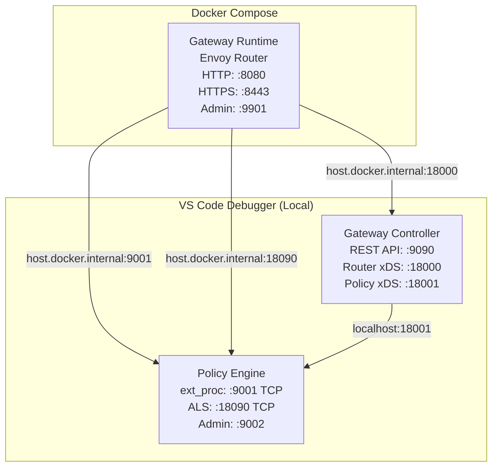

# Gateway Local Debug Guide

This guide explains how to debug the gateway with **Gateway Controller** and **Policy Engine** running locally in VS Code, and the **Gateway Runtime (Router)** running in Docker Compose.

## Architecture Overview



## Prerequisites

- VS Code with Go extension installed
- Docker and Docker Compose
- Control plane host and registration token (optional, for gateway registration)

## Step-by-Step Instructions

### Step 1: Configure Control Plane Connection

Update `.vscode/launch.json` in the **Gateway Controller** configuration with your control plane details:

```json
{
    "name": "Gateway Controller",
    "env": {
        "APIP_GW_CONTROLPLANE_HOST": "<your-control-plane-host>",
        "APIP_GW_GATEWAY_REGISTRATION_TOKEN": "<your-registration-token>",
        // ... other env vars
    }
}
```

> **Note:** Leave these empty (`""`) if you want to run in standalone mode without control plane connection.

### Step 2: Update Docker Compose Configuration

Edit `gateway/docker-compose.yml` and comment out the policy engine port mappings in the `gateway-runtime` service, keeping only the router ports:

```yaml
services:
  gateway-runtime:
    ports:
      # Router ports (keep these)
      - "8080:8080"   # HTTP
      - "8443:8443"   # HTTPS
      - "9901:9901"   # Admin

      # Policy engine ports (comment these out - running locally)
      # - "9001:9001"   # ext_proc
      # - "9002:9002"   # Policy engine admin
      # - "9003:9003"   # Metrics
      # - "18090:18090" # ALS
```

### Step 3: Start Gateway Controller

Run the **Gateway Controller** debug configuration from VS Code.

### Step 4: Run Gateway Builder

Run the **Gateway Builder** debug configuration from VS Code. This compiles all policies and generates the policy-engine binary into `gateway/gateway-builder/target/output/`.

> **Note:** Wait for the builder to complete successfully before starting the Policy Engine.

### Step 5: Start Policy Engine

Run the **Policy Engine - xDS** debug configuration from VS Code.

### Step 6: Start Gateway Runtime (Router)

Run the router in Docker Compose:

```bash
cd gateway
docker compose up gateway-runtime -d
docker compose logs -ft gateway-runtime
```

### Step 7: Deploy an API and Test

Deploy a test API via the Gateway Controller REST API:

```bash
curl -X POST http://localhost:9090/apis \
  -H "Content-Type: application/yaml" \
  --data-binary @path/to/api.yaml
```

Send a request to the deployed API:

```bash
curl http://localhost:8080/petstore/v1/pets
```
