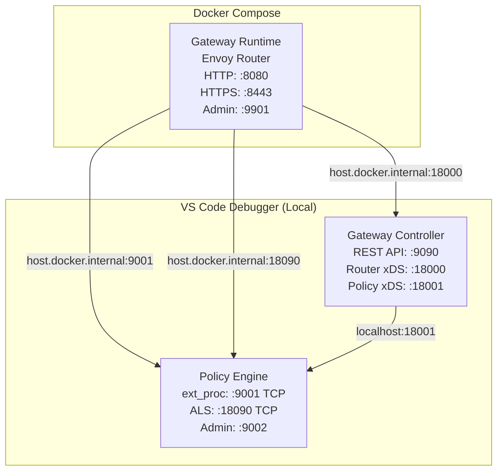

# Gateway Debug Guide

Two debug options are available. **Option 1 (Remote Debug)** is the recommended approach — everything runs in Docker and VS Code attaches via dlv. **Option 2 (Local Process)** runs the controller and policy engine as local VS Code processes with only the router in Docker.

---

## Option 1 (Recommended): Remote Debug — All Components in Docker

Gateway Controller and Policy Engine run inside Docker containers with dlv in server mode. VS Code attaches remotely.

### Step 1: Build Debug Images

```bash
cd gateway
make build-debug
```

This builds both `gateway-controller-debug:latest` and `gateway-runtime-debug:latest`.

### Step 2: Start the Full Stack

```bash
cd gateway
docker compose -f docker-compose.debug.yaml up
```

Wait until you see both containers are ready. The policy engine waits up to 30 seconds for dlv startup before the socket becomes available.

### Step 3: Set Breakpoints

Open the relevant source files in VS Code and set breakpoints:

- **Gateway Controller**: files under `gateway/gateway-controller/`
- **Policy Engine**: files under `gateway/gateway-runtime/policy-engine/`

### Step 4: Attach VS Code Debugger

In the VS Code **Run & Debug** panel, launch:

- **"Gateway Controller (Remote)"** — attaches to `localhost:2345`
- **"Policy Engine (Remote)"** — attaches to `localhost:2346`

Both can be attached simultaneously. Source path substitution is configured automatically in `.vscode/launch.json`:

| Component | Local path | Container path |
|---|---|---|
| Gateway Controller | `gateway/gateway-controller` | `/build` |
| Policy Engine | `gateway/gateway-runtime/policy-engine` | `/api-platform/gateway/gateway-runtime/policy-engine` |

### Step 5: Deploy an API and Trigger Breakpoints

```bash
# Deploy a test API
curl -X POST http://localhost:9090/apis \
  -H "Content-Type: application/yaml" \
  --data-binary @path/to/api.yaml

# Send a request through the router
curl http://localhost:8080/petstore/v1/pets
```

### Notes

- dlv runs with `--accept-multiclient` — you can detach and re-attach without restarting containers.
- Containers run as root (required by dlv for ptrace); resource limits are removed for debug headroom.
- Policy Engine socket wait timeout is 30s (vs 10s in production) to account for dlv startup overhead.
- All ports remain accessible: `9090` (Controller REST), `8080`/`8443` (Router), `9002` (PE admin), `18000`/`18001` (xDS).

---

## Option 2 (Alternative): Local Process Debug — Controller + Policy Engine in VS Code

Gateway Controller and Policy Engine run as local VS Code processes. Only the Envoy Router runs in Docker Compose.

> **Warning:** Processes run directly on the host, so Go resolves modules via `go.work`. Local versions of `sdk` and other workspace modules are used instead of the published Go module versions — including any uncommitted or untagged changes. Behavior may differ from a production build.

### Architecture



### Prerequisites

- VS Code with Go extension installed
- Docker and Docker Compose
- Control plane host and registration token (optional, for gateway registration)

### Step 1: Configure Control Plane Connection

Update `.vscode/launch.json` in the **Gateway Controller** configuration with your control plane details:

```json
{
    "name": "Gateway Controller",
    "env": {
        "APIP_GW_CONTROLPLANE_HOST": "<your-control-plane-host>",
        "APIP_GW_GATEWAY_REGISTRATION_TOKEN": "<your-registration-token>",
        // ... other env vars
    }
}
```

> **Note:** Leave these empty (`""`) if you want to run in standalone mode without control plane connection.

### Step 2: Update Docker Compose Configuration

In `gateway/docker-compose.yaml`, make two changes to the `gateway-runtime` service:

1. Set `GATEWAY_CONTROLLER_HOST` to `host.docker.internal` so the runtime reaches the locally-running controller:

```yaml
services:
  gateway-runtime:
    environment:
      GATEWAY_CONTROLLER_HOST: host.docker.internal
```

2. Comment out the **Policy Engine** port block:

```yaml
services:
  gateway-runtime:
    ports:
      # Router (Envoy) - keep these
      - "8080:8080"   # HTTP ingress
      - "8443:8443"   # HTTPS ingress
      - "8081:8081"   # xDS-managed API listener
      - "8082:8082"   # WebSub Hub dynamic forward proxy
      - "8083:8083"   # WebSub Hub internal listener
      - "9901:9901"   # Envoy admin
      # Policy Engine - comment these out
      # - "9002:9002"   # Admin API
      # - "9003:9003"   # Metrics
```

### Step 3: Start Gateway Controller

Run the **Gateway Controller** debug configuration from VS Code.

### Step 4: Run Gateway Builder

Run the **Gateway Builder** debug configuration from VS Code. This compiles all policies and generates the policy-engine binary into `gateway/gateway-builder/target/output/`.

> **Note:** Wait for the builder to complete successfully before starting the Policy Engine.

### Step 5: Start Policy Engine

Run the **Policy Engine - xDS** debug configuration from VS Code.

### Step 6: Start Gateway Runtime (Router)

Run the router in Docker Compose:

```bash
cd gateway
docker compose up gateway-runtime -d
docker compose logs -ft gateway-runtime
```

### Step 7: Deploy an API and Test

Deploy a test API via the Gateway Controller REST API:

```bash
curl -X POST http://localhost:9090/apis \
  -H "Content-Type: application/yaml" \
  --data-binary @path/to/api.yaml
```

Send a request to the deployed API:

```bash
curl http://localhost:8080/petstore/v1/pets
```
